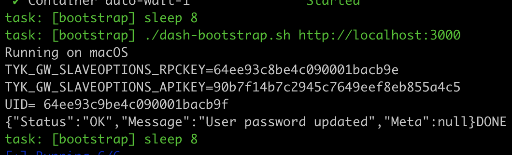

# Automated Testing

This directory hosts the automated testing infrastructure and code. Within each repo there are CI tests which are meant to quickly give feedback on PRs.

# Testing using tyk-automated-tests

Tyk can be deployed in many ways. A deployment is modelled by a compose file. `pro.yml` models a standard Tyk Pro installation.

## Directory structure
```
auto
├── deps.yml           # dependencies that can be reused between deployment models in a Pro deployment
├── pro.yml            # compose file defining the Tyk components in a Pro deployment
├── deps_pro-ha.yml    # dependencies that can be reused between deployment models in a Pro-HA deployment
├── pro-ha.yml         # compose file defining the Tyk components in a Pro-HA deployment
├── {mongo,postgres,..}.yml  # composable compose for 
├── pro/               # Tyk configs passed to services in pro.yml
├── pro-ha/            # Tyk configs passed to services in pro-ha.yml
├── confs/             # env var based config settings to override behaviour
├── local-*.env        # Env vars here can be set in the Tyk compose services by setting env_file=<file>
```

The configuration for the tyk components are provided via config files and env variables. The config files are used as the default configuration and behaviour can be overridden using environment variables in `confs/` or `local-*.env`.

# Running tests locally
## Pre-requisites
- docker compose plugin or above (not docker-compose)
- AWS integration account credentials
- dashboard license (`export TYK_DB_LICENSEKEY=`)
- mdcb license (`export TYK_MDCB_LICENSE=`)

## How to login to AWS ECR
You need an access token and a functional AWS CLI with the sub-account to publish, install, and delete packages in AWS ECR. There is [a note in OneLogin](https://tyk.onelogin.com/notes/108502) with the AWS credentials which have just enough privileges to push and pull from the registry as well as access to logs. Once you have the CLI functional, you can login with:
``` shellsession
% aws ecr get-login-password --region eu-central-1 | docker login --username AWS --password-stdin 754489498669.dkr.ecr.eu-central-1.amazonaws.com
```

## Bring up an env | Option 1 : Manual alias
This will bring up a Pro installation using the `master` branch for all components. It does not _build_ the images but relies on `release.yml` in the repo having already pushed the images to ECR. 
``` shellsession
# define an alias for later
$ alias master="env_file=local-mongo44.env confs_dir=./pro docker compose -f pro.yml -f deps.yml -f mongo44.yml -p master --profile all --env-file master.env"
$ cd auto
$ master up -d
```

## Bring up an env | Option 2 : [Automated Task file](https://taskfile.dev/installation/)
A bit of automation to allow easily pic diferent test scenarios.. This will bring up a Pro or Pro-HA installation using the `master` branch for all components. It does not _build_ the images but relies on `release.yml` in the repo having already pushed the images to ECR.

### Prerequisite
```brew install go-task```

### How to use
Execute on the root folder
#### Login
```task login```

#### creates environment
```task local FLAVOUR=pro DB=mongo44 VARIATION=murmur64```

#### destroys environment
```task clean FLAVOUR=pro DB=mongo44 VARIATION=murmur64```

### Avilable combinations
```
DB = [mongo44, postgres15]
VARIATION = [murmur64, sha256]
FLAVOUR = [pro, pro-ha]
```

## Run tests
In the `tyk-automated-tests` repo, assuming that you are in a virtualenv with all its dependencies installed,
``` shellsession
$ pytest -c pytest_local.ini --ci [ DIR | FILE | -m "markers" | -k "test_name" ]
```

### Examples
If you want to test over pro-ha environment you need to collect and export the value of `TYK_GW_SLAVEOPTIONS_APIKEY`
which outputs on environment UP bootstrap.sh 



``` shellsession
# Example for full test on pro environment with mongo
$ pytest -c pytest_local.ini --ci -m "not local and not dind and not mdcb"

# Example for full test on pro environment with sql
$ pytest -c pytest_local.ini --ci -m "not local and not dind and not mdcb and not sql"

# Example for full test on pro-ha environment with mongo
$ export USER_API_SECRET=${TYK_GW_SLAVEOPTIONS_APIKEY}
$ pytest -c pytest_local.ini --ci -m "not local and not dind"

# Example for full test on pro-ha environment with sql
$ export USER_API_SECRET=${TYK_GW_SLAVEOPTIONS_APIKEY}
$ pytest -c pytest_local.ini --ci -m "not local and not dind and not sql"

```
