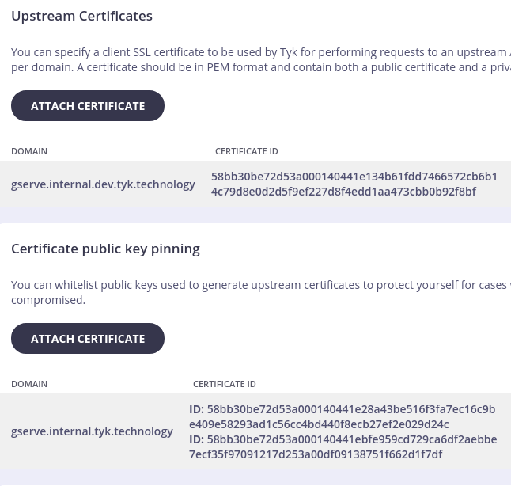

# Tyk CA
This CA is backed by cfssl and is available at http://cfssl.internal.dev.tyk.technology:8888

## Generating a server certificate
Given a server.json as below:

``` json
{
    "CN": "Integeration service",
    "hosts": [ "localhost", "gserve.internal.dev.tyk.technology" ],
    "key": {
        "algo": "rsa",
        "size": 2048
    },
    "names": [
        {
            "C": "UK",
            "L": "London",
            "O": "Tyk Technologies",
            "OU": "Devops",
            "ST": "Greater London"
        }
    ]
}
```

You'll need the `CFSSL_API_KEY` from someone who knows it. Or if you have access to the _internal_ cluster, inspect the _cfssl_ fargate task definition.

```shell
% CFSSL_API_KEY=sekret cfssl gencert -config=../../config.json -remote=cfssl.internal.dev.tyk.technology -profile=server server.json | cfssljson -bare server
```

This should leave `server.pem`(certificate), `server-key.pem`(key) in the current directory. 

Changing it to `-profile=client` will generate a client certificate.

## Enabling upstream access to gserve

`gromit server` only accepts mTLS requests. To make it easier to use this from github actions, it is proxied via Tyk Classic Cloud. Since this CA is not present in any distributed ca-certificates package, it is necessary to treat it as if it self-signed as far as Tyk Cloud goes. 

This is how I have done it:
1. Attach the client certificate bundle to section "Upstream Certificates"
1. Attach the server certificate bundle to section "Certificate public key pinning"
1. Generate the pubkey for the _server_ certificate with `openssl x509 -pubkey -out server-pubkey.pem -in server.pem`
1. Attempt to upload `server-pubkey.pem` in the "Certificate public key pinning" until you get an error saying that it is already uploaded with key
1. Copy the key id and paste it into the input field before "Add public key"
1. Options->Update at the API screen

This is how it should look when done.

